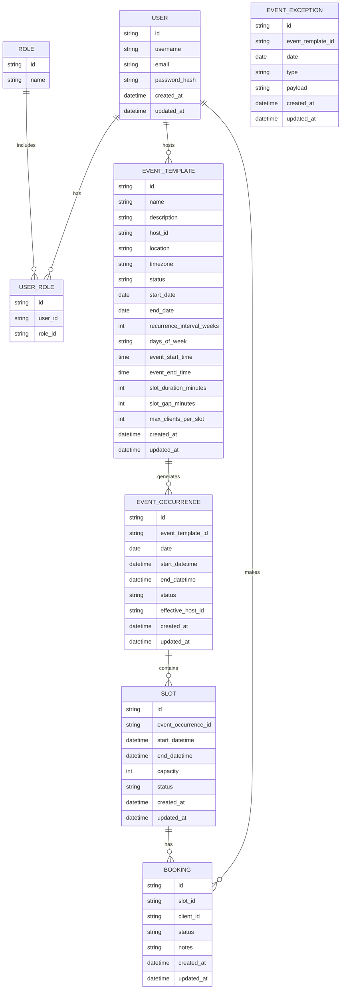

# Data Model and ER Diagram

This document describes the core data model for the reservation booking system.  
It is aligned with the requirements in `docs/requirements.md` and can be used as a reference when evolving the Prisma schema and database.

---

## 1. Entity‑Relationship (ER) Diagram

Below is a conceptual ER diagram in Mermaid notation.  
(You can visualize this with any Mermaid‑enabled viewer.)

> Note: Not all entities above exist in the current Prisma schema yet (e.g., `EVENT_TEMPLATE`, `EVENT_OCCURRENCE`, `EVENT_EXCEPTION`, `ROLE`, `USER_ROLE`). They represent a target model for future evolution.

---

## 2. Table List and Field Descriptions

This section provides a more detailed table‑by‑table breakdown of the conceptual model.  
Where relevant, we note how it maps (or could map) to the existing Prisma schema.

### 2.1 Users and Roles

#### 2.1.1 `User`

Represents any authenticated user of the system.

**Fields:**

- `id` (PK, string/UUID) – unique identifier.
- `username` (string, unique) – login handle.
- `email` (string, unique) – used for communication and recovery.
- `password_hash` (string) – hashed password.
- `created_at` (datetime) – creation timestamp.
- `updated_at` (datetime) – last update timestamp.

#### 2.1.2 `Role`

Represents a role such as Admin, Host, or Client.

**Fields:**

- `id` (PK, string/UUID).
- `name` (string, unique) – role name (e.g., "ADMIN", "HOST", "CLIENT").

#### 2.1.3 `UserRole`

Join table for many‑to‑many User ↔ Role.

**Fields:**

- `id` (PK, string/UUID).
- `user_id` (FK → `User.id`).
- `role_id` (FK → `Role.id`).

**Constraints:**

- Unique (`user_id`, `role_id`) to prevent duplicate role assignments.

---

### 2.2 Event Templates and Exceptions

#### 2.2.1 `EventTemplate`

Conceptual successor to the current `Resource` + availability rules.  
Represents a series definition with recurrence.

**Fields:**

- `id` (PK, string/UUID).
- `name` (string, required).
- `description` (string, optional).
- `host_id` (FK → `User.id`) – primary host.
- `location` (string, optional).
- `timezone` (string, e.g., IANA TZ identifier).
- `status` (enum: draft, published, archived).

Scheduling fields:

- `start_date` (date, required).
- `end_date` (date, optional, `null` for open‑ended).
- `days_of_week` (string or smallint bitmask, required) – which days of the week the event may run.
- `recurrence_interval_weeks` (int, default 1).
- `event_start_time` (time).
- `event_end_time` (time).
- `slot_duration_minutes` (int).
- `slot_gap_minutes` (int, default 0).
- `max_clients_per_slot` (int, default 1).

Timestamps:

- `created_at` (datetime).
- `updated_at` (datetime).

#### 2.2.2 `EventException` (optional / future)

Represents exceptions to the template (cancelled date, modified times, etc.).

**Fields:**

- `id` (PK, string/UUID).
- `event_template_id` (FK → `EventTemplate.id`).
- `date` (date) – date affected by the exception.
- `type` (enum: cancelled, modified).
- `payload` (JSON, optional) – details for modified cases (e.g., new times or capacity).
- `created_at` (datetime).
- `updated_at` (datetime).

---

### 2.3 Event Occurrences and Slots

#### 2.3.1 `EventOccurrence`

Represents a concrete instance of an EventTemplate on a specific date.

**Fields:**

- `id` (PK, string/UUID).
- `event_template_id` (FK → `EventTemplate.id`).
- `date` (date, required).
- `start_datetime` (datetime, required).
- `end_datetime` (datetime, required).
- `status` (enum: scheduled, cancelled, completed).
- `effective_host_id` (FK → `User.id`, optional) – host responsible for this occurrence.
- `created_at` (datetime).
- `updated_at` (datetime).

#### 2.3.2 `Slot`

Represents a bookable time slice within an EventOccurrence.

**Fields:**

- `id` (PK, string/UUID).
- `event_occurrence_id` (FK → `EventOccurrence.id`).
- `start_datetime` (datetime).
- `end_datetime` (datetime).
- `capacity` (int).
- `status` (enum: available, full, closed, cancelled).
- `created_at` (datetime).
- `updated_at` (datetime).

**Constraints:**

- Unique (`event_occurrence_id`, `start_datetime`) to prevent duplicate slots for the same time.
- Index on (`event_occurrence_id`, `start_datetime`) to query slots efficiently by occurrence/date.

---

### 2.4 Bookings

#### 2.4.1 `Booking`

Represents a client’s reservation of a slot.

**Fields:**

- `id` (PK, string/UUID).
- `slot_id` (FK → `Slot.id`).
- `client_id` (FK → `User.id`).
- `status` (enum: pending, confirmed, cancelled, no_show).
- `notes` (string/text, optional).
- `created_at` (datetime).
- `updated_at` (datetime).

**Constraints:**

- Unique (`slot_id`, `client_id`, `status` in [pending, confirmed]) can be considered to avoid duplicate active bookings by the same client for the same slot.
- The count of active bookings per slot must not exceed the slot’s `capacity` (enforced via transactions and/or DB checks).

---

## 3. Mapping to Current Implementation

The current Prisma schema in this repository uses the following entities:

- `Resource` – roughly analogous to `EventTemplate` but simplified.
- `AvailabilityRule` – weekday/time rules attached to a `Resource`.
- `Reservation` – bookings referencing a `Resource` and specific start/end datetimes.

As the project evolves:

- `Resource` is expected to converge toward `EventTemplate`.
- `AvailabilityRule` remains useful but may be supplemented or replaced by `EventException` and explicit `EventOccurrence` records.
- `Reservation` is expected to align closely with `Booking` and may gain explicit foreign keys to `Slot` rather than storing times directly.

---

## 4. Next Steps

- Decide which parts of the conceptual model to implement in **Phase 1** (e.g., EventTemplate + implicit occurrences, no explicit slots table vs. fully normalized model).
- Incrementally evolve the Prisma schema, keeping this document as a reference and updating it as the data model changes.
